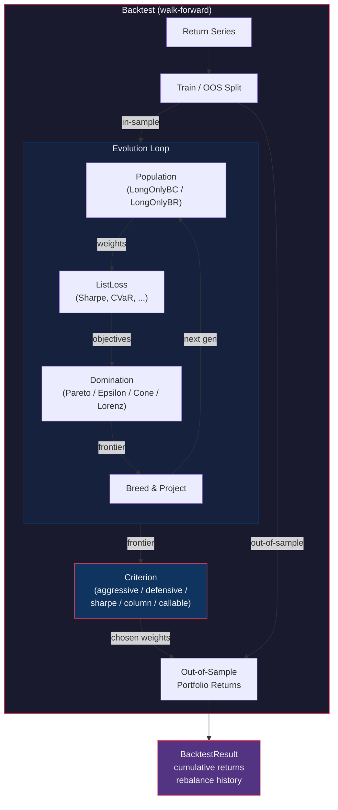
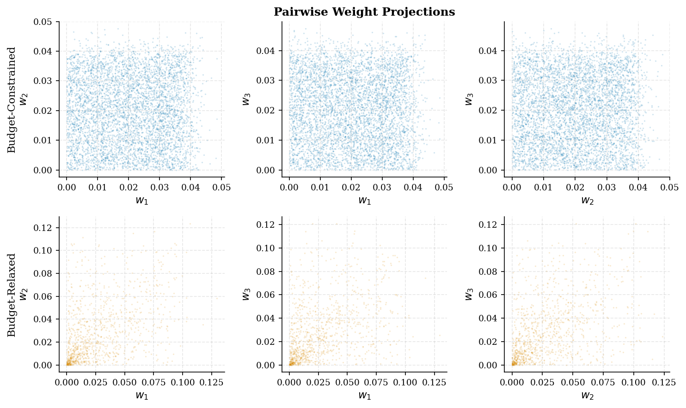
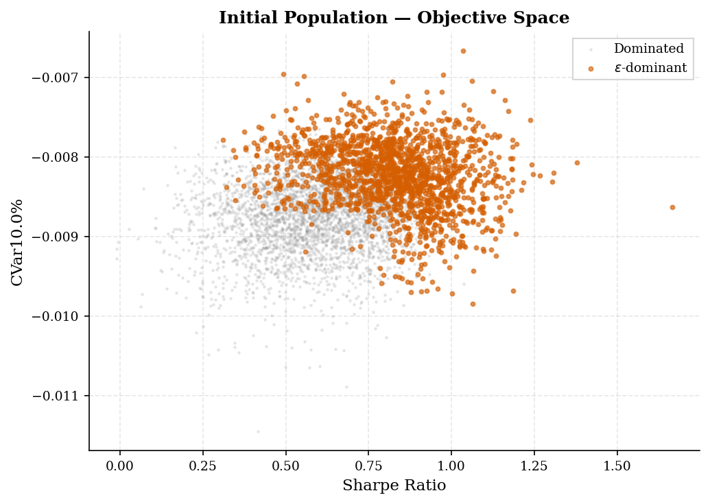
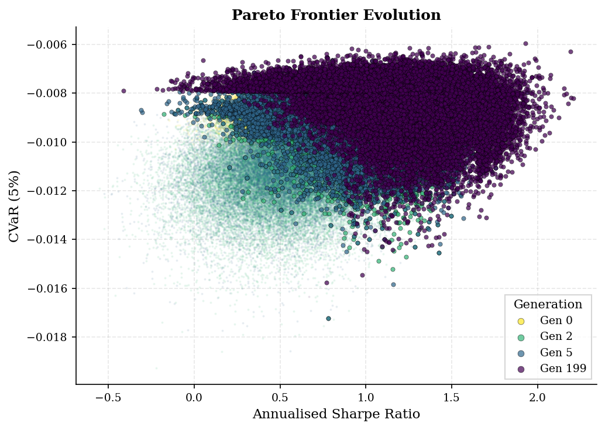
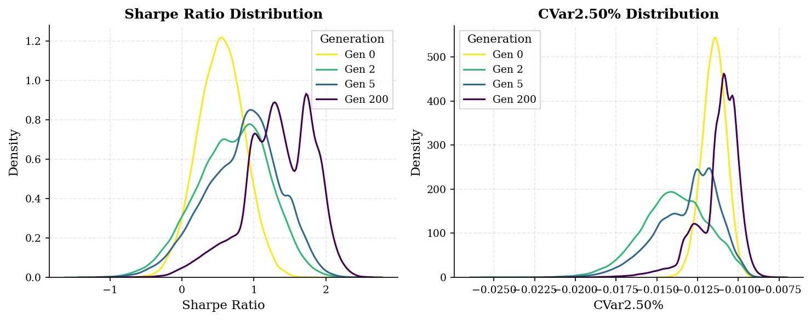
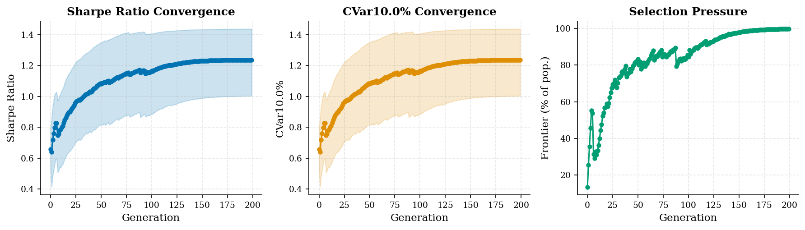
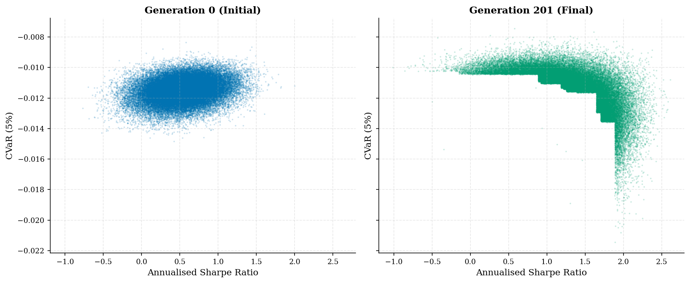
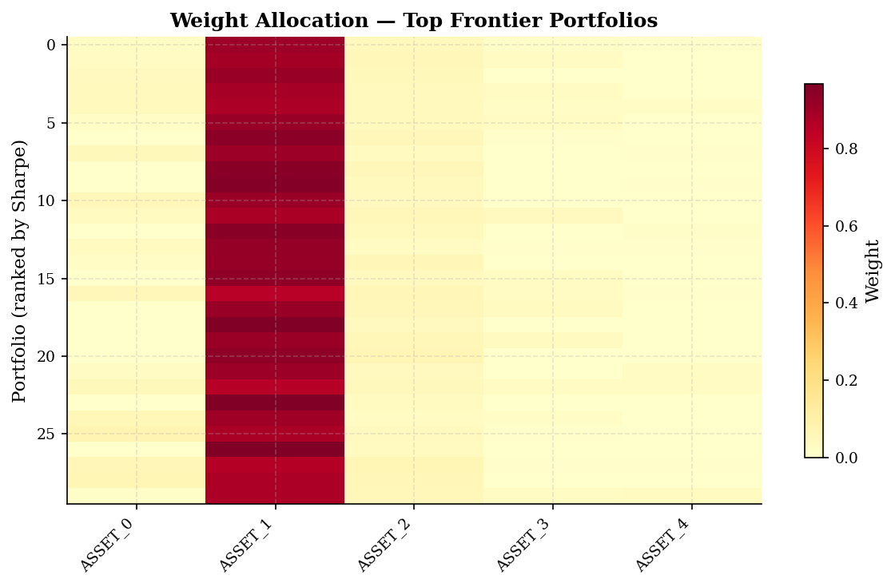

# evoport

Evolutionary multi-objective portfolio optimisation in Python.

**evoport** constructs portfolios by evolving a population of weight vectors over
multiple generations. At each step, portfolios are evaluated on competing risk and
return objectives, non-dominated solutions are selected via
epsilon-dominance, and new candidates are bred through Gaussian perturbation with
projection back onto the feasible set.

## Quick Start

```bash
pip install -e .
```

```python
from utils.populations.implementations import LongOnlyBC
from utils.loss.sharpe import Sharpe
from utils.loss.cvar import CVaR
from utils.loss.template import ListLoss
from utils.domination import epsilon

population = LongOnlyBC(problem_dimension=5, population_size=50_000)
losses = ListLoss([Sharpe('Sharpe'), CVaR('CVaR')])

# Evaluate and select
results = losses.evaluate(population.initial_weights, data_package)
frontier = epsilon.epsilon_dominant(df=results, ...)
```

See [`examples/populations.ipynb`](examples/populations.ipynb) for a full walkthrough.

## Features

| Component | Description |
|---|---|
| **Populations** | `LongOnlyBC` (budget-constrained, fully invested) and `LongOnlyBR` (budget-relaxed, partial cash) |
| **Objectives** | Sharpe, Sortino, Mean Return, Max Drawdown, CVaR, VaR, Win Rate, Win/Loss, Annualised Downside Variance |
| **Domination** | Pareto, Epsilon, Cone, Lorenz |
| **Breeding** | Gaussian perturbation with automatic projection to feasibility |
| **Evolution** | `Evolution` class wrapping the generational loop: evaluate, select frontier, breed, repeat |
| **Backtest** | Walk-forward backtesting with expanding or rolling windows and pluggable portfolio selection criteria |

## Architecture



## How It Works

### 1. Population Sampling

Portfolios are sampled uniformly over the feasible weight simplex. Two constraint
types are supported:

- **Budget-Constrained (BC):** weights are non-negative and sum to exactly 1.
- **Budget-Relaxed (BR):** weights are non-negative and sum to at most 1, allowing a cash position.



### 2. Multi-Objective Evaluation

Each portfolio is evaluated on multiple objectives simultaneously. Here we optimise
the annualised Sharpe ratio against CVaR at 5%. The initial population spans the
full objective space, and epsilon-dominance identifies the non-dominated frontier.



### 3. Evolutionary Selection

Over successive generations, dominated portfolios are culled and replaced by
offspring of frontier members. The frontier compresses toward the Pareto-optimal
trade-off curve.



### 4. Objective Distributions

The population's objective distributions shift rightward (better) with each
generation, confirming systematic improvement.



### 5. Convergence

Median objectives improve monotonically. Selection pressure (frontier fraction)
stabilises as the population concentrates near optimality.



### 6. Before and After

The contrast between the initial random population and the evolved population in
objective space.



### 7. Portfolio Composition

Top-ranked frontier portfolios concentrate weight in the highest risk-adjusted-return
assets, with smooth variation along the frontier.



## Backtest & Selection Criteria

The `Backtest` class runs a walk-forward backtest over a return series. At each
rebalance point it trains a fresh evolutionary optimisation on the in-sample window,
then selects a single portfolio from the resulting frontier using a **criterion**:

| Criterion | Behaviour |
|---|---|
| `'sharpe'` | Pick the frontier portfolio with the best Sharpe ratio (default) |
| `'aggressive'` | Maximise expected return — selects the highest-return end of the frontier |
| `'defensive'` | Minimise portfolio variance (w'Σw), falling back to lowest weight concentration |
| `'<column>'` | Optimise any objective column by name, respecting its minimax direction |
| `callable` | Pass a function `(EvolutionResult) -> np.ndarray` for fully custom selection |

```python
from utils.backtest import Backtest

bt = Backtest(
    population_cls=LongOnlyBC,
    population_kwargs={'problem_dimension': 5, 'population_size': 50_000},
    list_loss=losses,
    domination_fn=epsilon.epsilon_dominant,
    n_generations=10,
    criterion='defensive',   # or 'aggressive', 'sharpe', a column name, or a callable
)
result = bt.run(returns, train_window=252, step_size=21, expanding=True)
```

## Project Structure

```
evoport/
  data/              # Price data and generation scripts
  examples/          # Jupyter notebooks
  images/            # Generated figures
  utils/
    domination/      # Pareto, epsilon, cone, Lorenz dominance
    enums/           # Data enums
    loss/            # Objective functions (Sharpe, CVaR, etc.)
    populations/     # Population sampling and breeding
    evolution.py     # Generational evolution loop
    backtest.py      # Walk-forward backtesting engine
```

## Dependencies

- NumPy, Pandas, SciPy, Matplotlib, Seaborn
- CVXPY (for convex baselines)

## License

MIT
